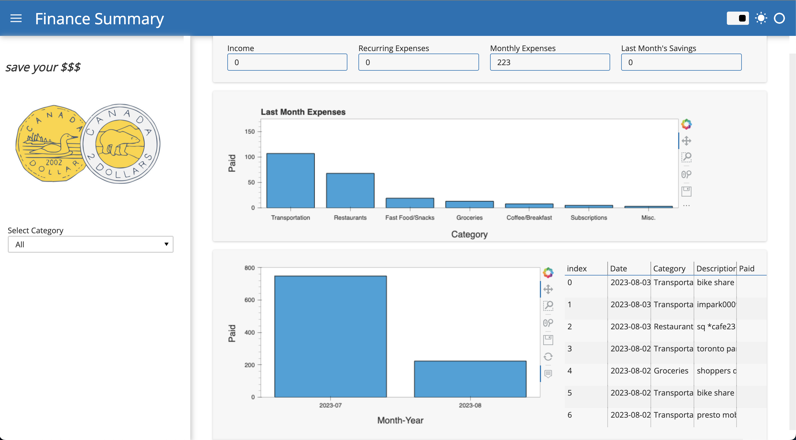
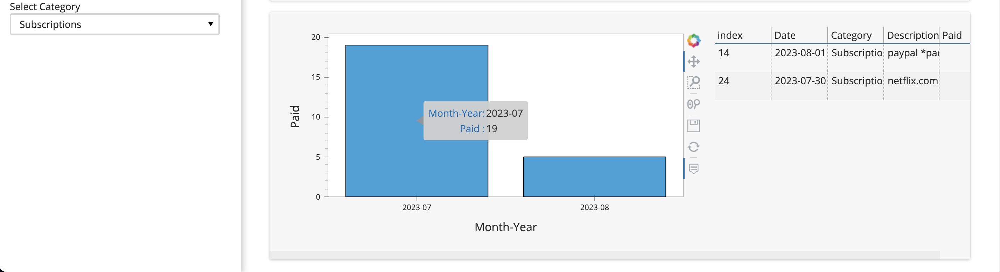

# Personal Finance Dashboard



## Description

This project is a personal finance dashboard built using Python and various libraries. The goal of this dashboard is to provide an overview of your spending habits based on your credit card transactions. It categorizes your transactions, creates visualizations to help you understand your expenses, and allows you to track your financial progress.

## Features

- Accesses Google Drive via the Google Drive API to read credit card transaction data from a Google Sheets file.
- Uses the Pandas library to load and clean the transaction data.
- Categorizes transactions into different categories such as transportation, restaurants, fast food, etc.
- Creates visualizations to compare spending based on categories and timeframes.
- Calculates savings by taking into account income, recurring expenses, and monthly expenses.
- Provides an interactive dashboard with bar charts, trend charts, and summary tables.

## Libraries Used

- Pandas: Data manipulation and cleaning.
- Numpy: Numerical operations.
- Gspread: Google Drive API integration.
- Panel: For creating interactive dashboards.
- Hvplot: Interactive plotting library.
- Holoviews: Visualization library.

## How to Run

1. Clone this repository to your local machine.
2. Install the required libraries using the following command:

```bash
pip install pandas numpy gspread panel hvplot holoviews

```

1. Make sure you have the necessary credentials to access Google Drive using the Google Drive API.
2. Update the script to include your Google Sheets file and adapt the categorization logic to match your transaction descriptions.
3. Run the script to generate the dashboard.

## Getting Started

1. Open the script file and provide your Google Sheets file information.
2. Customize the category assignment logic to match your transaction descriptions.
3. Run the script to generate the dashboard.
4. Use the interactive dashboard to explore your spending habits, track your expenses, and analyze your financial situation

## What I Learned

Through this project, I gained valuable experience in:

- Accessing external data sources using APIs
- Cleaning and preprocessing data using Pandas.
- Creating interactive visualizations for data analysis.
- Developing an interactive dashboard using Panel.
- Applying various manipulation techniques to analze personal finance data.

## Screenshots



